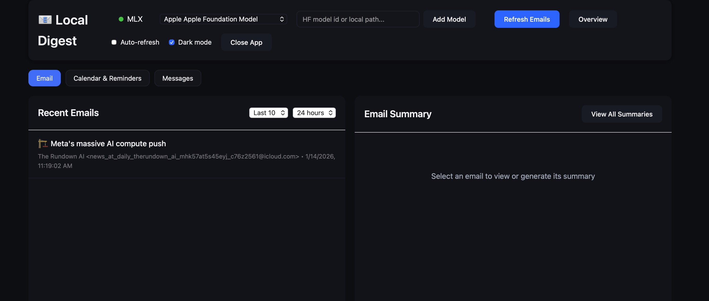

# Local Digest - MLX Local Models

A simple, fast local digest app that uses AppleScript to extract emails and MLX local models (via mlx-lm) for AI summarization.



## Features

- **Daily Overview**: One-click summary combining your emails, calendar, reminders, and messages into a single AI-generated digest of your day
- **Q&A Chat**: Ask follow-up questions about any email, calendar event, or message thread and get AI-powered answers with context
- Extract emails directly from Apple Mail using AppleScript
- Summarize emails using local MLX models
- View upcoming calendar events and summarize key details
- View reminders due soon and summarize action items
- Summarize recent iMessage/SMS conversations (last 48 hours)
- Clean web interface
- SQLite database for storing summaries
- No complex Mail extensions or startup delays

## Requirements

- Python 3.8+
- MLX + mlx-lm installed (Apple Silicon macOS only)
- macOS (for AppleScript)
- Calendar, Reminders, and Messages access (macOS will prompt for permissions)
- (Optional) Apple Foundation Models (macOS 26+ with Apple Intelligence enabled)

## Installation

1. Create a virtual environment and install dependencies:
```bash
python3 -m venv venv
./venv/bin/pip install -r requirements.txt
```

2. (Optional) Set a model to use:
```bash
export MLX_MODEL=mlx-community/gemma-3-1b-it-qat-4bit
```

Optional configuration:
- `MLX_MODEL_LIST` - comma-separated list of models to show in the UI
- `MLX_TEMPERATURE` - sampling temperature (default 0.5)
- `MLX_MAX_TOKENS` - max tokens per response (default 2048)
- `APPLE_FM_BRIDGE_PATH` - path to the Apple Foundation Models bridge binary
- `APPLE_FM_TIMEOUT` - seconds to wait for bridge responses (default 30)

## Usage

1. Start the server:
```bash
python app.py
```

2. Open your browser to http://localhost:5001

3. Click "Refresh Emails" to load latest emails

4. Click on any email to generate a summary

5. Use the tabs to switch between Email, Calendar/Reminders, and Messages

## Apple Foundation Model (Local)

This app can call Apple’s on-device Foundation Models through a small Swift bridge.
You need macOS 26+ with Apple Intelligence enabled and Xcode 16+.

Build the bridge:
```bash
./scripts/build_apple_foundation_bridge.sh
```

Then restart the app. If the bridge is available, the model selector will show:
`🍎 Apple Foundation Model`. You can also override the binary path:
```bash
export APPLE_FM_BRIDGE_PATH=/path/to/apple_foundation_bridge
```

## How It Works

1. **Email Extraction**: Uses AppleScript to read emails directly from Mail.app
2. **Summarization**: Runs MLX local inference for AI summarization
3. **Storage**: Saves email summaries in SQLite database for quick retrieval
4. **Web UI**: Simple Flask app with modern interface and tabs for each source

## API Endpoints

- `GET /` - Main web interface
- `GET /api/status` - Check MLX status
- `GET /api/emails` - Get latest emails from Mail
- `GET /api/calendar` - Get upcoming calendar events
- `GET /api/reminders` - Get today's reminders
- `GET /api/messages` - Get recent message threads (default last 48 hours)
- `POST /api/summarize` - Generate summary for an email
- `POST /api/summarize-generic` - Summarize calendar/reminders/messages
- `POST /api/overview` - Generate daily overview combining all sources
- `POST /api/chat` - Ask follow-up questions about emails with context
- `GET /api/summaries` - Get all saved summaries
- `DELETE /api/summaries/<id>` - Delete a summary
- `POST /api/clear-all` - Clear all summaries

## Permissions

macOS will ask for permission the first time the app accesses Mail, Calendar,
Reminders, or Messages. Grant access to allow those tabs to load data.

If Messages still shows empty, the app can fall back to reading
`~/Library/Messages/chat.db` (requires Full Disk Access for the venv Python
binary). You can control this with `MESSAGES_DB_FALLBACK=1`.

If macOS won’t let you select the venv Python binary, you can add
`MessagesPython.app` (in the project root) to Full Disk Access and launch
the server by opening that app.

## Troubleshooting

- If emails don't load, make sure Mail.app is running
- If summaries fail, check that mlx-lm is installed and the model can load
- If model not found, set `MLX_MODEL` to a valid local or HF model ID

## Using MLX Models

### Already Downloaded Models

If you have MLX models already downloaded on your machine (e.g., from LM Studio or previous mlx-lm usage), you can use them directly by providing the local path:

```bash
export MLX_MODEL=/path/to/your/local/model
export MLX_MODEL_LIST=/path/to/model1,/path/to/model2
```

Common locations for downloaded models:
- LM Studio: `~/.cache/lm-studio/models/`
- Hugging Face cache: `~/.cache/huggingface/hub/`

### Downloading New Models

Models can also be pulled from the Hugging Face Hub the first time you reference them.
Pick a model ID and set it in `MLX_MODEL` (or add it to `MLX_MODEL_LIST`), then
run the app and mlx-lm will download it automatically.

You can also add a Hugging Face model ID directly from the UI using the
"Add Model" input; the server saves it and warms it up on first use.

Examples:
```bash
export MLX_MODEL=mlx-community/Meta-Llama-3.1-8B-Instruct-4bit
export MLX_MODEL_LIST=mlx-community/Meta-Llama-3.1-8B-Instruct-4bit,mlx-community/Mistral-7B-Instruct-v0.3-4bit
```
