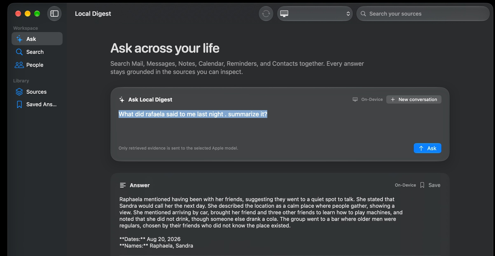

# Local Digest

Local Digest is a native SwiftUI macOS app for searching and understanding
your personal archive. The shipping target is `LocalDigest.xcodeproj`, which
targets macOS 26 and uses Apple Foundation Models:

- `SystemLanguageModel` for on-device answers.
- `PrivateCloudComputeLanguageModel` for Apple Private Cloud Compute answers on
  macOS 27 and later.

On macOS 26, the app uses the on-device model and does not offer Private Cloud
Compute. Compatible hardware and Apple Intelligence are still required for
the on-device model.

The app builds a local SQLite FTS5 index over the sources you authorize. It
searches historical Contacts, Calendar, Reminders, Mail, Notes, and Messages
records rather than only fetching the newest item. Natural-language questions
such as “What did Rui tell me last night?” are planned with person and time
constraints, matched against bounded evidence, and returned with source
citations.

Retrieved content is treated as untrusted data. It cannot change the
assistant's instructions, and the app never sends, edits, deletes, or creates
personal items.

## Screenshots



*Ask grounded questions across the sources you authorize.*

## Permissions and sources

- Contacts uses the Contacts framework.
- Calendar and Reminders use EventKit full-access APIs.
- Mail and Notes use read-only Apple Events after automation permission.
- Messages uses the local read-only `chat.db` and reports when Full Disk Access
  is required.

The source screen reports permission, unavailable, indexing, and indexed-count
states. No source is represented as available until its adapter confirms
access.

## Build and test

Build the native app:

```sh
xcodebuild -project LocalDigest.xcodeproj -scheme LocalDigest -sdk macosx \
  -destination 'platform=macOS,arch=arm64' -configuration Debug \
  -derivedDataPath /tmp/local-digest-normal-derived build
```

Build the app and test bundle:

```sh
xcodebuild -project LocalDigest.xcodeproj -scheme LocalDigest -sdk macosx \
  -destination 'platform=macOS,arch=arm64' -configuration Debug \
  -derivedDataPath /tmp/local-digest-test-derived \
  CODE_SIGNING_ALLOWED=NO build-for-testing
```

`LocalDigestTests` uses synthetic fixtures for date parsing, identity
resolution, FTS ranking, prompt boundaries, and source permission reporting.
It never reads personal message content.

For a local run, `script/build_and_run.sh` uses a locally configured development
profile when one is available and launches the provisioned app. If no suitable
profile is installed, it falls back to a safe Apple Local preview because macOS
rejects restricted PCC entitlements on an ad-hoc signature. A profile and
identity may also be supplied explicitly:

```sh
LOCAL_DIGEST_SIGNING_IDENTITY='Apple Development: Your Name (…)'
LOCAL_DIGEST_PROVISIONING_PROFILE='/path/to/pcc-development.provisionprofile'
./script/build_and_run.sh
```

A Developer ID profile and signature are required for distribution and
notarization.

## Entitlements

`LocalDigest.entitlements` contains the exact capabilities used by the
working sibling macOS apps:

- `com.apple.developer.private-cloud-compute`
- `com.apple.security.automation.apple-events`

The checked-in project intentionally leaves the developer-team identifier and
provisioning-profile name unset. Configure signing locally in Xcode or provide
the identity and profile paths above. Release remains automatic so a future App
Store or Developer ID distribution profile can be selected separately. An
ad-hoc signature cannot carry the restricted PCC entitlement.

Verify a signed build with:

```sh
codesign -d --entitlements :- \
  '/tmp/local-digest-normal-derived/Build/Products/Debug/Local Digest.app'
```

The retired web/runtime implementation is not part of the shipping product.
The existing `email_summaries.db` file is intentionally left untouched as
user data; the native app uses its own Application Support index.

## License

Local Digest is released under the MIT License. See [LICENSE](LICENSE) for the
copyright notice and the permissions granted to use, copy, modify, publish,
distribute, sublicense, and sell the software.
